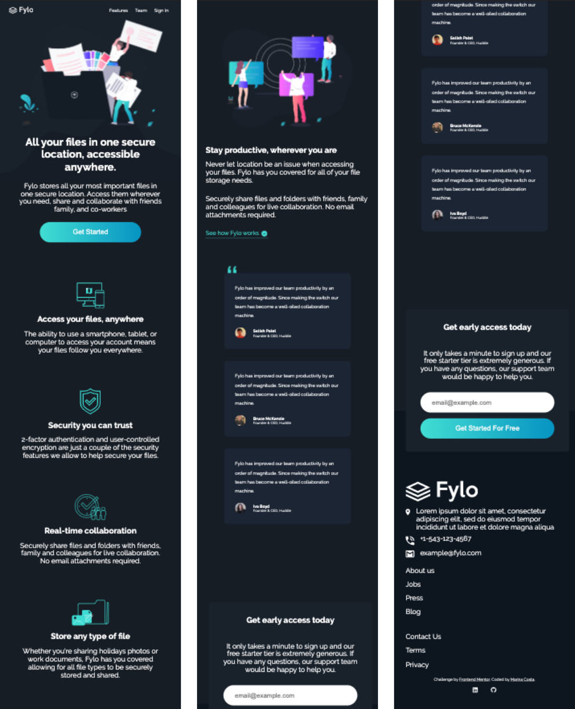
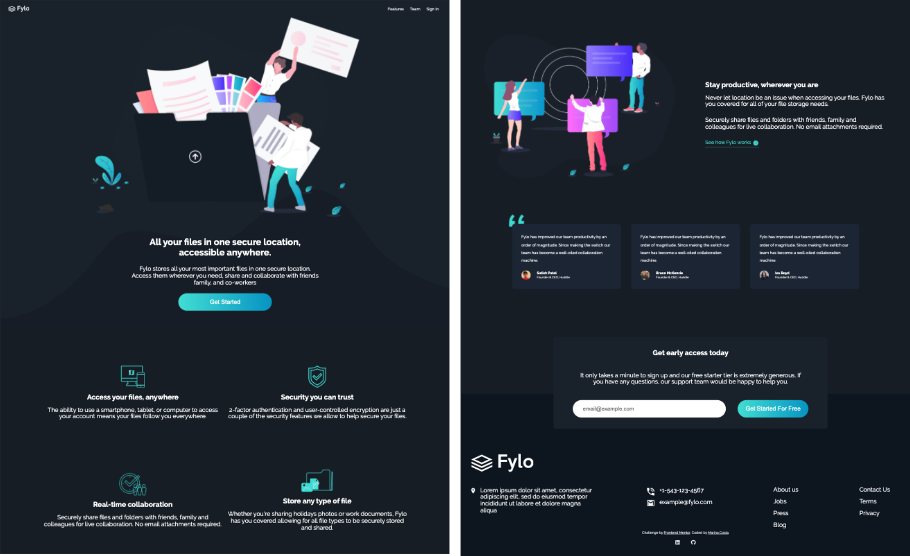

<h1 align="center">Frontend Mentor - Fylo landing page with dark theme</h1>

I created this landing page based on the [Frontend Mentor - Fylo landing page with dark theme](https://www.frontendmentor.io/challenges/fylo-dark-theme-landing-page-5ca5f2d21e82137ec91a50fd) design.

## Overview

- Here you can preview the results for mobile and desktop:

## Goals

- The goal of this project was to practice creating a responsive website following the design provided by Frontend Mentor.
- I was provided the design, including texts, images, icons and a style guide and I had to create that design in HTML and CSS. 

## How to install it

- Download the files and open `index.html` on the browser.

## References

* [Frontend Mentor](https://www.frontendmentor.io/challenges/fylo-dark-theme-landing-page-5ca5f2d21e82137ec91a50fd)
* [MDN Documentation](https://developer.mozilla.org/en-US/)